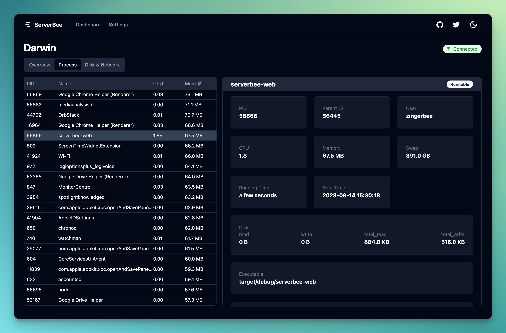
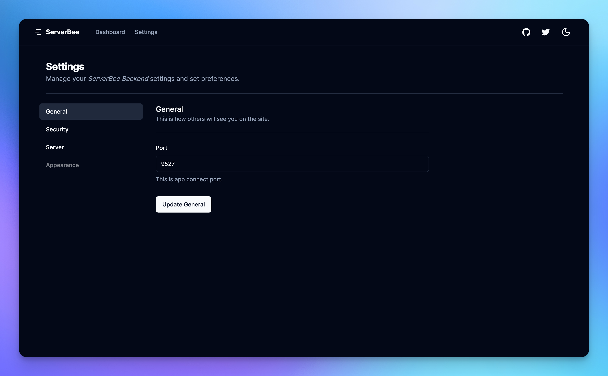
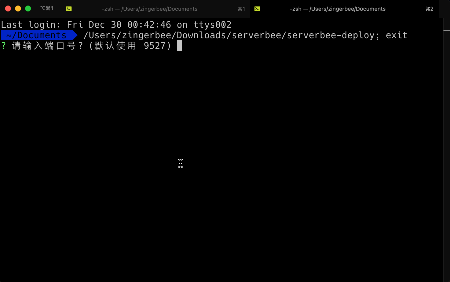

Language : [🇺🇸 English](./README.md) | 🇨🇳 简体中文

<h1 align="center">server_bee-backend</h1>

<div align="center">

iOS 应用 [ServerBee](https://apps.apple.com/us/app/serverbee/id6443553714) 的后端

<a href="https://www.producthunt.com/posts/serverbee?utm_source=badge-featured&utm_medium=badge&utm_souce=badge-serverbee" target="_blank"></a>


</div>

# 概述
- `web` 模块提供来自机器的数据
- `deploy` 模块提供 **开机启动**、**自动更新**、**下载 Web 模块** 的功能

## Web 仪表盘




## 交互式安装


# 特点

- CPU 负载
- 平均负载
- 内存使用情况
- 正常运行、启动时间
- 文件系统装载（和磁盘使用）
- 磁盘I/O统计信息
- 网络接口
- 网络流量统计
- 进程列表
- 进程详细信息
- 杀死进程
- 进程所属子进程

# 如何使用

## 安装
### Linux、MacOS

从 [Release 页面](https://github.com/ZingerLittleBee/server_bee-backend/releases) 获取最新版本下载地址

```bash
# 注意根据系统架构下载对应版本
# macOS
wget https://github.com/ZingerLittleBee/server_bee-backend/releases/download/v1.2.1/serverbee-deploy-x86_64-apple-darwin.zip
unzip serverbee-deploy-x86_64-apple-darwin.zip

# Linux
wget https://github.com/ZingerLittleBee/server_bee-backend/releases/download/v1.2.1/serverbee-deploy-x86_64-unknown-linux-musl.zip
unzip serverbee-deploy-x86_64-unknown-linux-musl.zip

# 默认端口是 9527
./serverbee-deploy
```

### Windows

1. 从 [release 页面](https://github.com/ZingerLittleBee/server_bee-backend/releases) 下载最新版本 `serverbee-deploy-x86_64-pc-windows-gnu.zip`

2. 解压 serverbee-deploy-x86_64-pc-windows-gnu.zip

3. 双击启动 serverbee-deploy.exe

## 更多配置

### 交互式安装
```bash
./serverbee-deploy -i
```

### 使用自定义端口
```bash
./serverbee-deploy -p 8081
# 对于未使用 deploy 模块的用户，可以使用以下命令
./serverbee-web -p 8081
```

### 开机自启 (默认打开)
```bash
./serverbee-deploy -a true
```

### 关闭开机自启
```bash
./serverbee-deploy -a false
```

### 例子
```bash
./serverbee-deploy -p 8081 -a false -u true
```

# 配置相关 API
以下接口只能从 `localhost` 访问

## 查看所有配置
```bash
curl http://localhost:9527/local/config
```
响应如下:
```json
{
    "success": true,
    "data": {
        "web_server": {
            "port": 9527
        },
        "server": {
            "token": "token",
            "host": "serverhub.app",
            "disable_ssl": false
        },
        "app": {
            "token": "token"
        }
    }
}
```

## 查看 `web_server` 配置
> web 服务器的相关配置，包括端口号
```bash
curl http://localhost:9527/local/config/web_server
```
响应如下:
```json
{
  "success": true,
  "data": {
    "port": 9527
  }
}
```

## 更新 `web_server` 配置
```bash
curl -X POST -H "Content-Type: application/json" -d '{"port": 9527}' http://127.0.0.1:9527/local/config/web_server
```
响应如下:
```json
{
  "success": true
}
```

## 查看 `app` 配置
> app 的相关配置，包括通讯密钥
```bash
curl http://localhost:9527/local/config/app
```
响应如下:
```json
{
  "success": true,
  "data": {
    "token": "token"
  }
}
```

## 更新 `app` 配置
```bash
curl -X POST -H "Content-Type: application/json" -d '{"token": "newToken"}' http://localhost:9527/local/config/app
```
响应如下:
```json
{
  "success": true
}
```

## 查看 `server` 配置
> server 的相关配置，包括通讯密钥、服务器地址、是否禁用 SSL
```bash
curl http://localhost:9527/local/config/server
```
响应如下:
```json
{
  "success": true,
  "data": {
    "token": "token",
    "host": "serverhub.app",
    "disable_ssl": false
  }
}
```

## 更新 `server` 配置
```bash
curl -X POST -H "Content-Type: application/json" -d '{"token": "newToken", "host": "serverhub.app", "disable_ssl": false}' http://127.0.0.1:9527/local/config/server
```
响应如下:
```json
{
  "success": true
}
```

# 从源码编译
## 1. 构建前端源码
> 需要安装 nodejs、pnpm
```shell
pnpm -C view install
pnpm -C view build
```
构建产物在 `view/out` 目录下

## 2. 构建 web、deploy 模块源码
> 需要安装 rust
```bash
cargo build --release
```
然后你可以在 `target/release` 找到可执行文件

# 发现问题或提出建议

[创建 issue](https://github.com/zingerlittlebee/server_bee-backend/issues/new)

# 发行说明

[CHANGELOG](CHANGELOG.md)

# 更多
[官网](https://serverbee.app/)

[文档](https://docs.serverbee.app/)

[App Store](https://apps.apple.com/us/app/serverbee/id6443553714)
